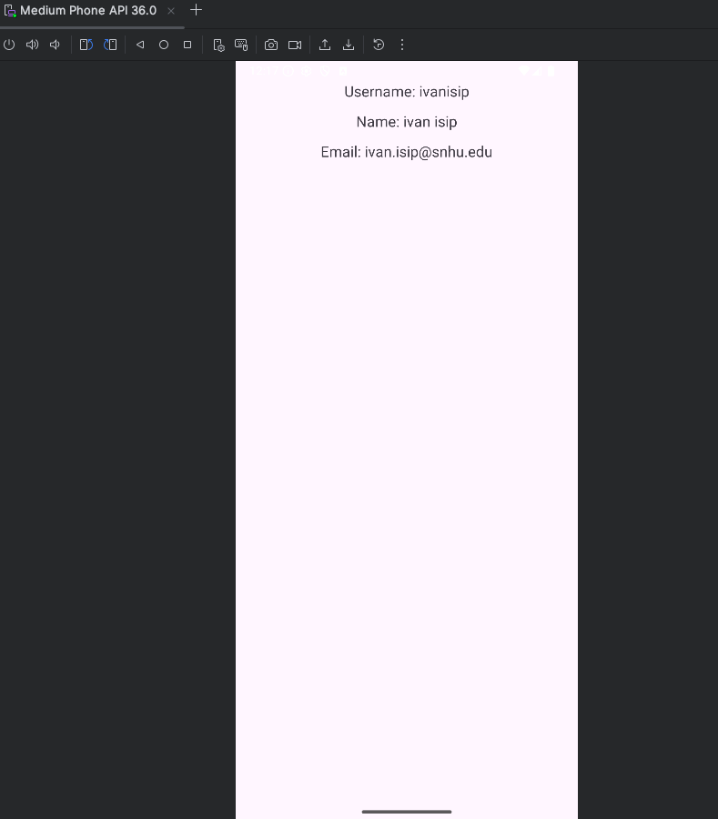
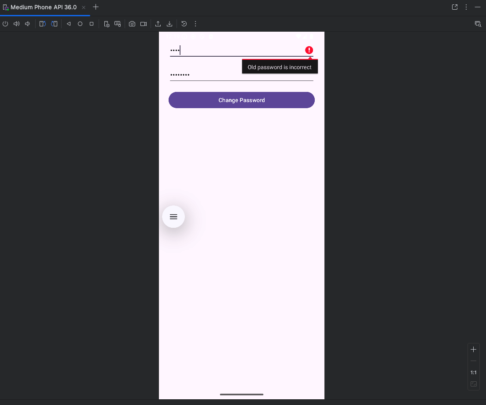

Enhancement 1 Software Design and Engineering

Purpose and user problem
Users need a clear flow from login to event creation and event review. The app needs consistent session handling and reduced duplicate logic to lower maintenance effort.

Original state
The app worked end to end, but some logic repeated across activities. Session data handling needed consistency across screens.

Enhancements
- Standardized session storage and retrieval across screens.
- Reduced duplicate navigation and shared logic.
- Kept screens focused on one job per activity.

Evidence

Login and navigation entry

Event flow

Edit and delete flow

Account and password screens

