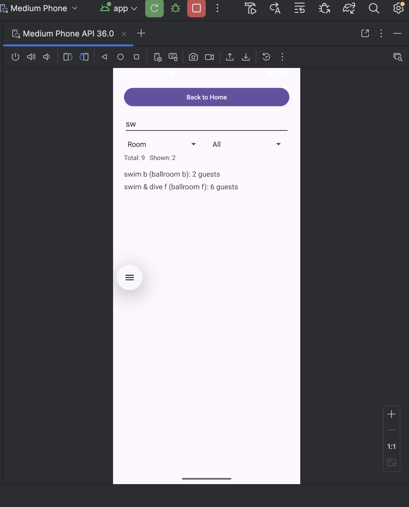
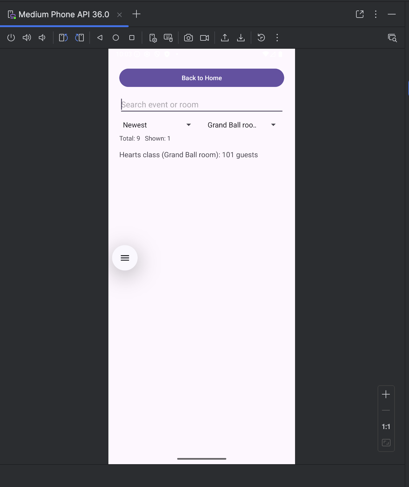
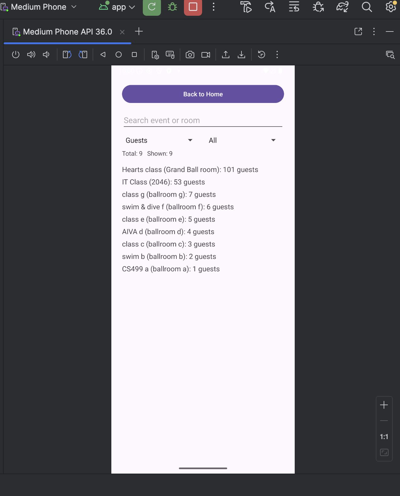
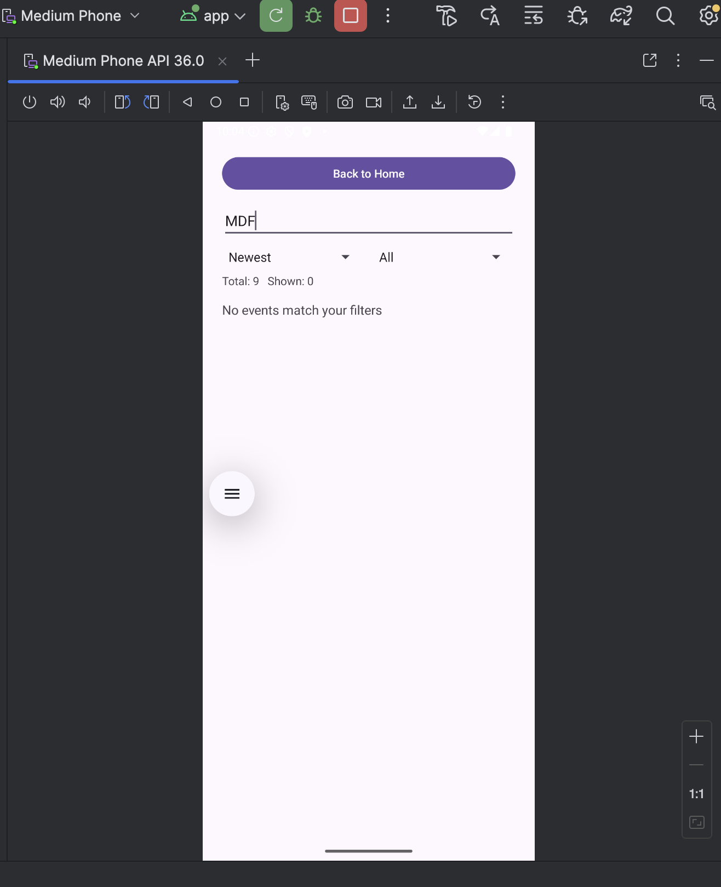

Enhancement 2 Algorithms and Data Structures

Purpose and user problem
Users need fast filtering and predictable sorting when the event list grows. The app must show results counts and handle empty results cleanly.

Original state
The list displayed events, but sorting and filtering needed clearer behavior and better feedback during search.

Enhancements
- Added search filter for event name or room.
- Added room filter dropdown.
- Added sort option for guest count.
- Added clear empty state when filters return no rows.

Evidence

